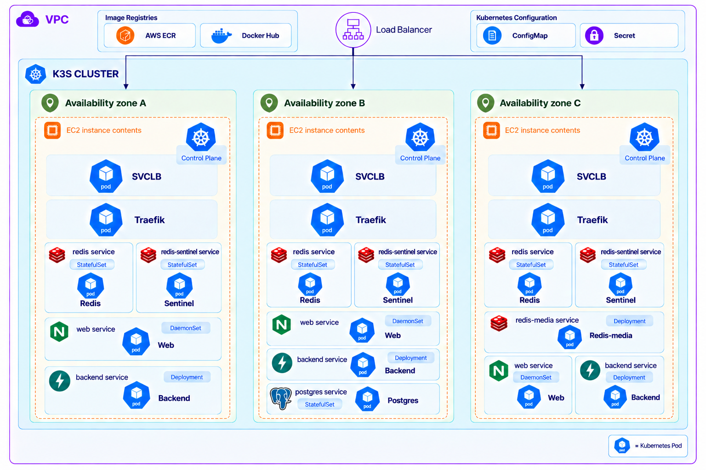

# EmoSelfie 인프라 아키텍처 설계서

> 문서 기준일: 2026-09-16
> 대상 환경: AWS 운영 환경(`prod`)
> 범위: 사용자 요청이 서비스에 진입해 AI 추론 결과를 받기까지의 인프라 및 런타임 구조

## 1. 프로젝트 개요

### 1.1 프로젝트 주제

- **프로젝트명:** 이모셀피(EmoSelfie)
- **주제:** 실시간 감정 인식 파티 게임을 위한 Kubernetes 기반 AI 서비스 운영 환경 구축
- **서비스 설명:** 참여자가 무작위로 제시된 감정을 셀카로 표현하고, AI 모델의 감정 분류 결과를 점수로 환산해 순위를 겨루는 브라우저 기반 실시간 파티 게임이다.
- **프로젝트 목표:** 컨테이너 이미지 빌드부터 Kubernetes 배포, 외부 접근, 상태 확인과 기본 관제까지 이어지는 운영 환경을 구축하고 검증한다.

서비스 측면에서는 가족·친구·동료 모임에서 별도 준비 없이 참여할 수 있는 아이스브레이킹 경험을 제공한다. 텍스트나 퀴즈 대신 참여자의 표정과 반응을 게임 요소로 사용하고, AI 분석 결과를 공통된 기준의 점수로 제공한다.

인프라 측면에서는 개발 환경의 AI 서비스를 여러 사용자가 접근할 수 있는 운영 환경으로 배포하고, 운영자가 배포 상태와 장애 여부를 확인할 수 있게 한다. 모델 준비 시간이 필요한 AI 서비스와 실시간 통신의 특성을 고려해 서비스 준비 상태, 자원 할당, 다중 Pod 배치와 요청 연결을 관리한다.

### 1.2 제공하는 AI 기능

사용자가 제출한 JPEG 이미지에서 얼굴을 찾고, 얼굴 영역을 7가지 감정으로 분류한다. 게임은 해당 라운드의 목표 감정 확률을 0~100점으로 환산한다.

| 구분 | 내용 |
|---|---|
| 입력 | 사용자 셀카 JPEG 이미지 |
| 얼굴 검출 | MediaPipe Face Detector(BlazeFace short range) |
| 감정 분류 | PyTorch ResNet50, AffectNet 학습 가중치 |
| 출력 | 얼굴 검출 여부, 7개 감정별 확률, 상위 감정, 목표 감정 점수 |
| 감정 라벨 | 기쁨, 슬픔, 분노, 놀람, 시크, 우웩, 무서움 |
| 실행 방식 | 외부 추론 API 호출이 아닌 Backend Pod 내부 CPU 추론 |

### 1.3 사용한 AI 모델 또는 API

외부 추론 API나 임베딩 API를 사용하지 않는다. Backend Pod가 다음 두 모델을 직접 로드해 추론한다.

- **이미지 감정 분류 모델:** [`FER_static_ResNet50_AffectNet.pt`](https://huggingface.co/ElenaRyumina/face_emotion_recognition/blob/586bafda3d5ca1427d62b9447f1bea70171663e1/FER_static_ResNet50_AffectNet.pt)
  - AffectNet으로 학습된 PyTorch ResNet50 모델이다.
  - 검출된 얼굴을 7가지 감정 확률로 분류한다.
- **얼굴 검출·crop 모델:** [`blaze_face_short_range.tflite`](https://storage.googleapis.com/mediapipe-models/face_detector/blaze_face_short_range/float16/1/blaze_face_short_range.tflite)
  - Google MediaPipe의 근거리 BlazeFace 모델이다.
  - 이미지에서 얼굴 영역을 검출하고, 가장 큰 얼굴을 감정 분류 입력으로 사용한다.

다운로드 전용 init container가 모델 파일의 크기와 SHA-256을 검증한 뒤 Backend 컨테이너에 읽기 전용으로 제공한다. 애플리케이션 시작 시 모델 로드와 warm-up이 끝나기 전에는 Pod가 Ready 상태가 되지 않는다.

### 1.4 인프라 구축 목표

- **재현 가능한 배포:** Docker 이미지와 Kubernetes 매니페스트로 배포 절차를 일관되게 관리한다. 운영 이미지는 `sha-`와 소스 커밋 해시 앞 12자리로 구성한 불변 태그를 사용해 배포 버전을 추적한다.
- **로컬·운영 환경 구성:** 로컬에서는 k3d로 배포 구성을 검증하고, AWS EC2에서는 k3s 기반 운영 환경을 구성한다. 환경별 차이는 Kustomize overlay로 관리한다.
- **외부 접근과 내부 통신:** Namespace로 환경별 리소스를 구분하고 Deployment, DaemonSet, StatefulSet, Service와 Ingress로 Web 및 AI API의 실행·접근 경로를 구성한다.
- **서비스 준비 상태와 가용성 관리:** 상태 확인 엔드포인트와 startup/readiness/liveness probe로 요청 처리 가능 여부를 확인한다. 다중 Backend Pod의 노드 분산과 실시간 요청의 연결 일관성도 관리한다.
- **자원 관리와 기본 관제:** CPU·Memory Request/Limit을 설정하고, Pod 상태·이벤트·로그·자원 사용량을 조회해 배포 결과와 장애 지점을 확인할 수 있게 한다.
- **개인정보 최소화:** 원본 셀카는 영구 저장하지 않고 메모리에서 처리하며, 결과 표시용 이미지만 짧은 TTL로 캐시한다.

## 2. 설계 목표

이 아키텍처는 다음 목표를 우선한다.

1. **실시간성**: HTTP 업로드와 AI 추론을 분리하고, 결과는 Socket.IO로 전달한다.
2. **서비스 연속성**: 3개 k3s server 노드와 HPA로 조정되는 Backend Pod를 분산 배치해 단일 노드 장애의 영향을 줄인다.
3. **일관된 세션**: HTTP, WebSocket, polling 요청이 같은 사용자와 Backend Pod로 이어지게 한다.
4. **안전한 카메라 사용**: 외부 구간을 HTTPS로 강제해 브라우저의 카메라 보안 조건을 충족한다.
5. **개인정보 최소화**: 원본 사진은 메모리에서 처리하고, 결과용 이미지만 짧게 캐시한다.
6. **재현 가능한 배포**: AWS 리소스는 Terraform, 노드 및 애플리케이션 배포는 Ansible과 Kustomize로 관리한다.

## 3. 전체 아키텍처

### 3.1 구성 요소별 역할

| 계층 | 구성 요소 | 역할 |
|---|---|---|
| Client | React SPA | 카메라 촬영, 셀카 압축·제출, Socket.IO 실시간 화면 갱신 |
| DNS/TLS | Route 53, ACM, ALB | 도메인 연결, TLS 종료, HTTP의 HTTPS 전환, 3개 노드로 부하 분산 |
| Ingress | Traefik | URL 경로에 따라 Web 또는 Backend Service로 전달하고 WebSocket을 처리 |
| 정적 Web | Nginx DaemonSet + Service | React 빌드 결과와 SPA fallback 제공. Backend 장애와 정적 페이지 제공을 분리 |
| AI API | FastAPI Deployment + Service + HPA | 세션·방·라운드 API, 이미지 접수, AI 추론, 채점, Socket.IO 이벤트 제공. CPU 부하에 따라 1~3개 Pod로 확장 |
| AI Runtime | MediaPipe + PyTorch ResNet50 | 얼굴 검출 후 7개 표정 확률 계산. Pod 내부에서 CPU 추론 |
| 영속 데이터 | PostgreSQL + StatefulSet | 방, 참여자, 라운드, 제출 결과, 리액션 등 복원이 필요한 데이터 저장 |
| 실시간 상태 | Redis + Sentinel | 분산 타이머, 제출 상태, Socket.IO Pub/Sub, rate limit, master failover |
| 이미지 캐시 | redis-media | 결과 화면에 잠시 노출할 재인코딩 이미지 저장. 유실을 허용하는 LRU 캐시 |
| 모델 공급 | prepare-models init container + hostPath | 모델을 내려받아 체크섬을 검증하고 노드 디스크에 캐시 |
| 설정 | ConfigMap / Secret | 일반 설정과 민감 값을 분리해 Pod에 주입 |
| 운영 관측 | Probe, ALB health check, 컨테이너 로그 | 준비 상태, 생존 상태, 외부 경로 상태 및 장애 원인 확인 |

## 4. 네트워크와 요청 흐름

### 4.1 정적 웹 페이지 요청

1. 사용자가 `https://emoselfie.click`에 접속한다.
2. Route 53이 도메인을 ALB로 연결한다.
3. ALB가 ACM 인증서로 TLS를 종료한다. 80 포트 요청은 443으로 리다이렉트한다.
4. ALB는 정상 상태인 k3s 노드의 80 포트로 HTTP 요청을 전달한다.
5. 노드의 Traefik Ingress가 `/`, `/assets`, `/r/*` 요청을 `web` Service로 전달한다.
6. Nginx Pod가 React 정적 파일을 반환한다. 클라이언트 라우트는 `index.html`로 fallback한다.

### 4.2 세션과 실시간 연결

1. React 앱은 같은 Origin의 `/api`를 호출해 익명 사용자 세션 쿠키 `es_uid`를 발급받는다.
2. `/socket.io` 연결도 같은 Origin과 쿠키를 사용해 Backend Service로 전달된다.
3. ALB 쿠키가 요청을 k3s 노드에 고정하고, Traefik의 `es_route` 쿠키가 polling 요청을 동일 Backend Pod에 고정한다.
4. Backend Pod들은 Redis Pub/Sub을 통해 방 상태와 이벤트를 공유하므로 서로 다른 Pod에 연결된 사용자도 같은 게임을 진행할 수 있다.

두 단계의 고정 라우팅은 WebSocket 자체보다 Socket.IO의 polling fallback을 위한 장치다. 한 세션의 handshake와 후속 polling 요청이 다른 노드나 Pod로 이동하면 세션을 찾지 못할 수 있기 때문이다.

### 4.3 셀카 제출과 AI 판정

1. 사용자가 셀카를 촬영하면 브라우저가 장변 최대 720px, JPEG 품질 0.8로 축소·압축한다.
2. 클라이언트가 `POST /api/rooms/{slug}/rounds/{roundId}/submissions`로 이미지와 촬영 토큰을 전송한다.
3. 요청은 `ALB → Traefik Ingress → backend Service → FastAPI Pod` 순서로 전달된다.
4. Backend는 본문을 읽기 전에 서버 수신 시각을 기록하고, 라운드 마감 여부·중복 제출·토큰·rate limit을 확인한다. 클라이언트 시각은 판정 기준으로 사용하지 않는다.
5. 이미지는 디스크 임시 파일로 저장하지 않고 크기 제한을 적용하며 메모리에서 읽는다.
6. 유효한 제출은 추론 작업으로 등록되고 클라이언트에는 `202 Accepted`와 제출 ID가 먼저 반환된다. AI 판정 완료를 HTTP 응답이 기다리지 않는다.
7. 전용 실행 스레드에서 다음 파이프라인을 수행한다.

   `JPEG decode → 얼굴 검출 → 얼굴 crop → 224×224 resize → BGR 변환 및 VGGFace2 평균 차감 → ResNet50 → Softmax`

8. 동시 추론은 Pod당 2건으로 제한하고, 개별 추론이 5초를 넘으면 판정 실패로 처리한다. CPU 연산은 비동기 이벤트 루프 밖에서 실행해 Socket.IO heartbeat 지연을 막는다.
9. 얼굴을 찾지 못하면 0점, 정상 판정이면 목표 감정 확률을 점수로 계산한다. 처리 오류와 timeout은 0점과 구분되는 `판정 불가` 상태로 기록한다.
10. 결과용 이미지는 재인코딩해 `redis-media`에 TTL과 함께 저장하고, 진행 상태는 Redis, 확정 결과는 PostgreSQL에 반영한다.
11. Backend가 `submission:scored` 이벤트를 Socket.IO로 발행하면 제출자들의 화면에 새 점수와 변경된 순위가 실시간으로 반영된다.

## 5. 배포와 데이터 흐름

### 5.1 배포 단위

- Terraform이 VPC의 3개 가용 영역에 EC2, 보안 그룹, IAM 역할, ALB, Target Group, Route 53 레코드를 구성한다.
- 3대의 EC2는 모두 k3s server이며 embedded etcd quorum을 형성한다. 세 노드 모두 워크로드도 실행한다.
- Ansible이 ECR 이미지 태그를 적용하고 운영 Secret, Traefik trusted proxy 설정, Kustomize 결과를 배포한다.
- Alembic migration은 Backend init container가 아니라 별도 Job으로 한 번만 실행한다. Replica마다 동시에 스키마 변경을 수행하는 문제를 피하기 위해서다.
- Backend Pod는 의존 서비스가 준비될 때까지 기다린 뒤 모델을 준비하고 애플리케이션을 시작한다.
- Backend HPA는 평균 CPU 70%를 기준으로 Replica를 1개에서 최대 3개까지 조정한다.

### 5.2 데이터 저장 정책

| 데이터 | 저장 위치 | 영속성/복제 | 설계 의도 |
|---|---|---|---|
| 방·참여자·라운드·확정 점수 | PostgreSQL | local-path PVC 5Gi, 단일 인스턴스 | 재접속과 결과 복원에 필요한 정합성 데이터 |
| 진행 상태·타이머·Pub/Sub | Redis | 3개 StatefulSet + Sentinel 3개, AOF | 다중 Backend Pod 사이의 실시간 조율과 master 장애 대응 |
| 결과 화면 이미지 | redis-media | 메모리, 단일 Replica, LRU 256MB | 사진 유실이 게임 점수 유실로 이어지지 않게 분리 |
| 원본 업로드 이미지 | 저장하지 않음 | 요청 처리 중 메모리에만 존재 | 얼굴 데이터의 불필요한 영구 보관 방지 |
| AI 모델 파일 | 노드별 `/models` hostPath | 노드 로컬 캐시, checksum 검증 | 반복 다운로드를 줄이는 현재의 임시 공급 방식 |

## 6. 주요 설계 결정

### 6.1 부하 테스트 결과에 따라 HPA 적용

고정 Replica로 운영하던 초기 구성에서 업로드 중심 부하 테스트를 수행한 결과, Backend Pod 하나의 CPU 사용률이 Request와 Limit의 99%까지 상승했다. 단일 Pod로는 순간적인 동시 제출을 처리할 여유가 부족하다고 판단해 `autoscaling/v2` HPA를 적용했다.

- 평상시에는 `minReplicas: 1`로 불필요한 자원 사용을 줄인다.
- 평균 CPU 사용률이 70%를 넘으면 scale-out한다.
- 3개 EC2 노드의 수용 범위에 맞춰 `maxReplicas: 3`으로 제한한다.
- 새 Pod는 모델 다운로드 확인, 로드와 warm-up을 거쳐야 하므로 실제 트래픽 투입까지 최대 120초가 걸릴 수 있다. HPA는 갑작스러운 첫 요청을 즉시 해결하는 장치가 아니라 지속되는 부하에 대응하는 장치다.

HPA 테스트 중 3개 Pod가 `2:1:0`으로 치우쳐 배치되는 현상도 확인했다. 이에 topology spread constraint를 `DoNotSchedule`, `maxSkew: 1`로 설정해 정상 상태의 3개 노드에는 Pod가 균등하게 배치되도록 했다. 노드 장애 시에는 Kubernetes가 NotReady 노드를 skew 계산에서 제외하므로 남은 노드에 다시 배치할 수 있다.

### 6.2 CPU·Memory Request와 Limit을 동일하게 설정

Backend는 `cpu: 1`, `memory: 2Gi`, Web은 `cpu: 50m`, `memory: 32Mi`로 Request와 Limit을 동일하게 설정한다.

- Backend는 PyTorch 모델을 상주시켜 메모리 사용이 크고, 노드 메모리 압박으로 축출되면 모델 재로딩과 warm-up이 필요하다.
- Request와 Limit을 같게 해 Guaranteed QoS를 받고 예측 가능한 자원을 확보한다.
- Web은 정적 파일만 제공하므로 작은 자원으로도 충분하지만, BestEffort Pod가 되어 먼저 축출되지 않도록 최소 자원을 명시한다.

### 6.3 Ingress와 동일 Origin 사용

Traefik Ingress 에서 정적 웹과 API를 경로로 분기한다. FE와 BE를 다른 Origin으로 분리하면 익명 사용자 식별 쿠키, Origin 검사, WebSocket 설정이 복잡해진다. 동일 Origin을 사용하면 브라우저 쿠키 정책을 일관되게 적용하고 CORS 의존성을 줄일 수 있다.

경로는 다음과 같이 나뉜다.

- `/api`, `/media`, `/socket.io`, `/health` → Backend Service
- 그 외 경로 → Web Service

### 6.4 NLB에서 ALB로 변경

초기에는 TCP 트래픽을 그대로 전달하는 Network Load Balancer를 구성했다. 그러나 NLB는 L4 장비이므로 TLS를 종료하더라도 Backend에 원래 요청이 HTTPS였다는 사실을 `X-Forwarded-Proto`로 전달할 수 없다. TLS를 통과시키는 방식은 각 노드의 Traefik에서 인증서를 별도로 관리해야 하는 문제도 있었다.

브라우저 카메라 API는 secure context를 요구하고 Backend는 Origin 검증 시 원래 요청 scheme을 알아야 하므로 L7 Application Load Balancer로 변경했다.

- ALB가 ACM 인증서로 443 포트의 TLS를 종료한다.
- 80 포트 요청은 443으로 `301` 리다이렉트해 평문 서비스 경로를 남기지 않는다.
- ALB가 `X-Forwarded-Proto: https`를 추가하고 노드 80 포트로 HTTP를 전달한다.
- HTTP `/health/live` 응답 코드로 노드 상태를 확인한다.
- Socket.IO polling 세션이 노드를 이동하지 않도록 ALB cookie stickiness를 사용한다.
- 장기 Socket.IO 연결을 고려해 idle timeout을 300초로 설정한다.

ALB 이후는 VPC 내부 HTTP이며 노드의 80 포트는 ALB 보안 그룹에서만 접근할 수 있다. 기존 보안 그룹 이름에 `-nlb`가 남아 있지만, 이름을 바꾸면 보안 그룹과 연관 규칙이 교체되므로 가동 중인 환경에서는 유지했다.

### 6.5 `X-Forwarded-Proto` 처리와 HTTPS 요청 복원

ALB에서 TLS를 종료하면 Backend Pod까지의 실제 연결은 HTTP이지만, 애플리케이션은 사용자가 HTTPS로 접속했다는 사실을 알아야 한다. 그렇지 않으면 HTTPS Origin과 HTTP request scheme이 달라져 `/api` POST와 WebSocket 연결이 `FORBIDDEN_ORIGIN`으로 거부된다.

처리 과정은 다음과 같다.

1. 사용자가 ALB의 HTTPS Listener로 접속한다.
2. ALB가 TLS를 종료하고 `X-Forwarded-Proto: https`를 추가한다.
3. 요청이 노드 80 포트와 k3s ServiceLB를 거쳐 Traefik으로 전달된다.
4. Traefik이 전달 헤더를 신뢰하지 않으면 이를 내부 연결 기준인 `http`로 덮어쓸 수 있다.
5. Ansible이 모든 k3s server 노드에 Traefik `HelmChartConfig`를 배포해 VPC CIDR과 k3s Pod CIDR에서 온 전달 헤더만 신뢰하도록 설정한다.
6. Uvicorn이 proxy header를 해석해 외부 scheme을 HTTPS로 복원하고, Backend가 올바른 Origin·Secure cookie 정책을 적용한다.

운영에서 `forwardedHeaders.insecure: true`를 사용하지 않고 `trustedIPs`를 제한한 이유는 외부 사용자가 임의의 `X-Forwarded-*` 헤더를 주입하는 것을 막기 위해서다. 보안 그룹에서도 노드 80 포트를 ALB에서만 허용해 접근 경계를 한 번 더 제한한다.

### 6.6 Terraform과 Ansible의 역할 분리

운영 환경은 서로 다른 가용 영역에 있는 EC2 3대로 구성된다. 여러 인스턴스를 수동으로 만들고 각각 설정하면 노드별 차이와 작업 누락이 발생하기 쉬워 Terraform과 Ansible의 역할을 분리했다.

- **Terraform:** EC2 3대, VPC·Subnet 참조, 보안 그룹, IAM 역할, EBS, ALB·Target Group, ACM 인증서 참조, Route 53 레코드와 k3s bootstrap 구성을 선언적으로 관리한다.
- **Ansible:** Terraform output에서 모든 노드 주소를 읽고 SSH host key를 검증한 뒤, 동일한 Traefik 설정을 각 server 노드에 배치한다. 이어 대표 server에서 kubeconfig를 가져와 ECR 인증 Secret, 운영 Secret, SHA 이미지 태그와 Kustomize overlay를 클러스터에 한 번 적용한다.

이 경계를 통해 인프라 생성·삭제는 Terraform state로 추적하고, 여러 인스턴스에 반복 적용되는 운영 설정은 Ansible의 멱등 작업으로 관리한다. 특히 Traefik 설정처럼 모든 server 노드에 같은 파일을 배치해야 하는 작업을 한 번의 playbook 실행으로 일관되게 처리할 수 있다.

### 6.7 Longhorn을 도입했다가 제거한 이유

처음에는 약 94MB의 감정 모델을 한 번만 다운로드하고 여러 노드의 Backend Pod가 공유하도록 Longhorn 분산 볼륨을 도입했다. 그러나 변경이 거의 없는 단일 모델 파일을 공유하기 위해 Longhorn 전체 스택을 운영하면서 모든 노드에 상시 메모리와 운영 비용이 발생했다. 모델 크기와 변경 빈도에 비해 저장 계층이 과도하게 복잡했다.

노드 메모리 비용과 장애 대응·업그레이드 복잡도가 ECR 및 로컬 디스크 비용보다 크다고 판단해 Longhorn과 모델 PVC를 제거했다. 현재는 다음과 같은 임시 구조를 사용한다.

- Backend의 `prepare-models` init container가 모델을 다운로드하고 크기와 SHA-256을 검증한다.
- 모델은 Pod가 배치된 노드의 `/models` hostPath에 캐시한다.
- 같은 노드에서 재시작하면 검증 후 캐시를 재사용하고, 다른 노드에 처음 배치되면 한 번 다시 다운로드한다.
- Backend 컨테이너에는 모델 디렉터리를 읽기 전용으로 마운트한다.

hostPath는 발표 일정 안에 Longhorn을 안전하게 제거하기 위한 중간 단계다. 최종 방향은 검증된 모델을 버전이 고정된 컨테이너 이미지에 내장해 외부 다운로드와 노드별 볼륨 자체를 없애는 것이다.

### 6.8 PostgreSQL, Redis, 이미지 캐시를 분리

모든 상태를 하나의 저장소에 넣지 않고 손실 허용 수준에 따라 분리했다.

- PostgreSQL은 확정 결과처럼 정합성과 복원이 중요한 데이터를 담당한다.
- Redis는 분산 타이머와 실시간 상태를 담당하고 Sentinel로 master failover를 제공한다.
- redis-media는 유실 가능한 사진만 보관하며 영속화·복제를 생략한다.

이 구조에서는 이미지 캐시 장애가 점수 데이터 장애로 확대되지 않는다.

### 6.9 Web을 DaemonSet으로 배포

각 k3s 노드에 정적 Web Pod를 하나씩 둔다. Backend 장애와 무관하게 랜딩 페이지와 정적 자산을 제공하고, ALB가 어느 노드로 요청을 보내더라도 로컬에 정적 서버가 존재하게 하기 위해서다. 노드 수가 고정된 소규모 클러스터이므로 DaemonSet의 운영 비용도 작다.

## 7. 모니터링과 운영

### 7.1 현재 적용된 관측 수단

현재 클러스터에는 별도 Prometheus/Grafana 스택이 포함되어 있지 않다. 실제 적용된 관측 수단은 다음과 같다.

- Kubernetes startup/readiness/liveness Probe
- ALB Target Group의 `/health/live` 검사
- k3s Metrics Server의 CPU 사용량과 이를 이용한 Backend HPA 상태
- `kubectl get pods`, 이벤트, 재시작 횟수를 통한 상태 확인
- `kubectl logs`를 통한 Backend, Web, PostgreSQL, Redis 로그 확인
- 배포 전후 HTTPS smoke test를 통한 WebSocket, polling, 실제 3라운드 추론 검증

로그에는 이미지 원본, base64, 얼굴 crop, 얼굴 좌표, 사용자 UUID를 남기지 않는 것을 원칙으로 한다.

## 8. 가용성, 보안 및 제약 사항

### 8.1 가용성 범위

- k3s control plane은 3개 server와 embedded etcd로 구성해 1개 server 장애 시 quorum을 유지한다.
- Backend는 HPA로 1~3개 Replica를 사용하며, 여러 Pod가 실행될 때 topology spread constraint로 노드별 균등 배치를 강제한다.
- Traefik은 노드 수에 맞춰 배치하고, Web은 DaemonSet으로 모든 노드에 둔다.
- Redis는 3개 인스턴스와 Sentinel 3개로 master 장애에 대응한다.

그러나 전체 시스템이 완전한 HA인 것은 아니다. PostgreSQL과 redis-media는 단일 인스턴스이며, local-path PVC는 특정 노드 디스크에 묶인다.

### 8.2 보안과 개인정보

- 외부 접속은 HTTPS만 허용한다.
- 노드 애플리케이션 포트는 ALB 보안 그룹에서만 접근하게 한다.
- SSH와 Kubernetes API는 관리자 CIDR에서만 허용한다.
- 운영 Secret은 저장소에 커밋하지 않는다.
- 모델과 런타임 이미지는 ECR의 고정 SHA 태그로 배포한다.
- 업로드 크기·픽셀 수·횟수를 제한하고 JPEG 형식을 검사한다.
- 원본 이미지는 DB나 파일 시스템에 저장하지 않는다.
- 미제출 사용자에게 다른 사용자의 사진과 점수 이벤트를 발행하지 않도록 Socket.IO room을 분리한다.

### 8.3 현재 제약과 개선 방향

| 현재 제약 | 영향 | 개선 방향 |
|---|---|---|
| PostgreSQL 단일 인스턴스 + local-path | 해당 노드 장애 시 DB 복구 전 서비스 중단 가능 | CloudNativePG 또는 관리형 RDS로 복제·failover 구성 |
| 모델 hostPath 캐시 | 새 노드에서 외부 저장소 다운로드가 필요하고 노드마다 중복 저장 | checksum이 고정된 모델 이미지를 빌드해 ECR에서 공급 |
| redis-media 단일 인스턴스 | 장애 시 결과 사진 유실 | MVP에서는 허용. 필요 시 Replica/외부 객체 저장소 검토 |
| Prometheus/Grafana 미구축 | 추론 지연과 용량 추세를 수동 확인 | 애플리케이션 메트릭 구현 후 대시보드·경보 구성 |
| HPA가 CPU 지표만 사용 | 모델 warm-up 전의 순간 부하나 추론 queue를 직접 반영하지 못함 | 추론 queue·지연시간 기반 custom metric과 노드 확장 연계 검토 |
|  |

## 9. 설계 요약

EmoSelfie의 핵심은 **HTTPS 단일 진입점**, **정적 Web과 AI API의 경로 분리**, **HTTP 접수와 비동기 AI 추론의 분리**, **Socket.IO 기반 실시간 결과 전파**, **데이터 중요도에 따른 PostgreSQL·Redis·이미지 캐시 분리**다.

현재 구성은 3노드 k3s, 노드 분산, CPU 기반 HPA로 애플리케이션 계층의 부하와 장애에 대응하면서 AI 추론이 사용할 자원을 고정해 예측 가능성을 높인다. 동시에 PostgreSQL 단일 인스턴스, 모델 hostPath, CPU 지표만 사용하는 HPA와 별도 메트릭 스택 부재는 현재 규모에서 수용한 제약으로 명시한다. 서비스 사용량이 늘어날 때 HA DB, 이미지 내장 모델, Prometheus 기반 관측과 추론 queue 기반 자동 확장 순으로 보강한다.
