# 기본 관제 대시보드 증빙 및 운영 부하 테스트 결과

작성일: 2026-09-16 · 대상: 운영 EC2 / namespace `emoselfie`

제공된 터미널·브라우저·k9s·EC2 모니터링 캡처 13장과 사용자 작성 부하 테스트 보고서를 정리한 문서다. 아래 다섯 항목은 요청된 제출 순서다. 캡처에서 읽은 사실, 사용자 보고 내용, 미확정 가설을 구분한다. 이번 문서 작성에서는 운영 조회·부하 재실행·배포를 수행하지 않았다.

## 현재 main 대조 기준

2026-09-16 문서 작성 중 `git ls-remote origin refs/heads/main`으로 GitHub 원격 main을 확인했고, 아래 로컬 main과 일치했다. 작업 브랜치의 과거 체크리스트를 현재 구현의 근거로 사용하지 않았다. 저장소 설정과 실제 운영 적용 여부는 별도로 구분한다.

| 저장소 | 확인한 main 커밋 |
|---|---|
| INFRA | `acc7eba1cce5f32847d7e24d4595e5ea19478490` |
| BE | `b2aefd4899f38b1a7cd104af602523de5fb6467e` |
| DOCS | `a37457e2226829ef86ad1e0b6248f96d8c65d804` |

| 항목 | main에서 확인한 내용 | 소스 |
|---|---|---|
| backend HPA | Deployment `backend`, 최소 1개·최대 3개, CPU request 대비 평균 목표 70% | [backend.yaml](https://github.com/k8s11r/emoselfie-INFRA/blob/acc7eba1cce5f32847d7e24d4595e5ea19478490/k8s/base/backend.yaml) |
| backend 자원 | CPU request/limit 각각 1, Memory request/limit 각각 2Gi | 위 backend.yaml |
| 운영 grace | `PARTICIPANT_GRACE_SEC=86400`; 소스 주석은 부하 테스트용 임시 설정으로 설명 | [prod overlay](https://github.com/k8s11r/emoselfie-INFRA/blob/acc7eba1cce5f32847d7e24d4595e5ea19478490/k8s/overlays/prod/kustomization.yaml) |
| 추론 동시성 | `INFERENCE_CONCURRENCY=2`, `INFERENCE_TORCH_THREADS=1` | [base kustomization](https://github.com/k8s11r/emoselfie-INFRA/blob/acc7eba1cce5f32847d7e24d4595e5ea19478490/k8s/base/kustomization.yaml) |
| 추론 큐 용량 | BE 기본값 24. 운영의 실제 유효값은 당시 환경 출력 미첨부 | [config.py](https://github.com/k8s11r/emoselfie-BE/blob/b2aefd4899f38b1a7cd104af602523de5fb6467e/app/core/config.py) |

## 캡처 환경과 시각

| 자료 | 확인 가능한 환경 | 시각 및 한계 |
|---|---|---|
| 첨부 1~5: kubectl | 터미널 호스트 `ip-172-31-57-252`; 1번은 전체 namespace, 2~4번은 `emoselfie`, 5번은 namespace 미지정 | 4번에 `Tue Sep 15 12:34:33 2026` 표시. 시간대는 화면에 없어 UTC/KST로 단정하지 않음. 나머지는 정확한 시각 미표시 |
| 첨부 6~7: 상태 확인 | macOS Safari에서 운영 HTTPS 도메인 접속 | 정확한 캡처 시각·시간대 미표시 |
| 첨부 8~10: k9s | context/cluster/user `default`, namespace `emoselfie`, k9s `v0.51.0`, Kubernetes `v1.36.4+k3s1` | 절대 시각 미표시. AGE로 상대 순서 비교 가능. 사용자 보고상 9월 16일 부하 테스트 관련 화면 |
| 첨부 11~13: EC2 모니터링 | AWS 서울 리전 `ap-northeast-2`, UTC 시간대 선택, 1시간 범위 | 그래프에 약 07:45~08:30 구간 표시. 날짜·정확한 캡처 시각 미표시. 사용자 보고상 아래 테스트 구간과 대응 |
| 부하 테스트 보고 | 운영 EC2, `https://emoselfie.click/`, 노드 3대·`t3.medium`은 사용자 제공 정보 | 2026-09-16 08:23:55~08:28:54 UTC = 17:23:55~17:28:54 KST |

**서로 다른 시점의 자료다.** 기본 상태 화면의 backend는 `backend-5999865965-*` 2개이고, 부하 화면은 `backend-978669df4-*` 1→3개다. 기본 상태의 2개를 이번 부하 테스트의 직전 replica 수로 사용하지 않는다. 이미지 디렉터리 날짜는 문서 정리 기준일이며 모든 이미지의 촬영일을 뜻하지 않는다.

## 1. Pod 상태

### 전체 namespace 상태 — 첨부 1

```bash
kubectl get pods -A
```

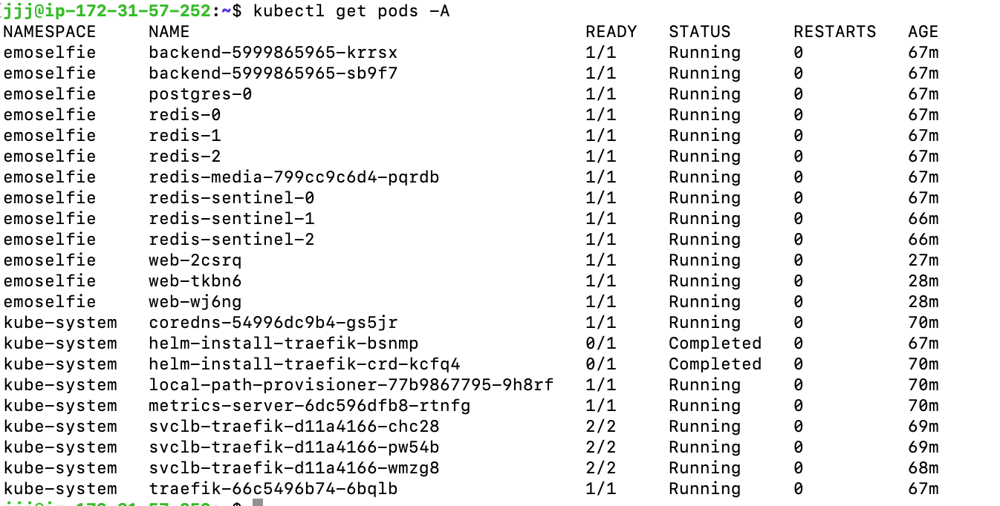

`emoselfie`의 13개 Pod가 모두 `1/1 Running`, `RESTARTS=0`으로 표시된다. 구성은 backend 2개, PostgreSQL 1개, Redis 3개, media Redis 1개, Redis Sentinel 3개, web 3개다. `kube-system`의 Traefik 설치 작업 2개는 `Completed`이며 실행 중 서비스 Pod와 구분한다.

### Pod 배치 — 첨부 2

```bash
kubectl get pods -n emoselfie -o wide
```

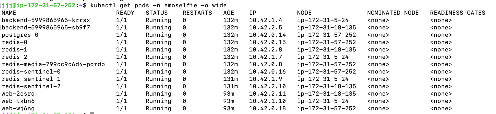

이 화면에서도 13개 Pod가 모두 `1/1 Running`, 재시작 0회다. 노드는 `ip-172-31-57-252`, `ip-172-31-5-24`, `ip-172-31-18-135`로 구분되고, backend 2개와 web 3개의 배치를 확인할 수 있다. 첨부 1과 AGE가 달라 동일 순간의 출력은 아니다.

**판정:** 캡처 순간의 Pod 준비·실행 상태는 정상이다. 장기간 무중단 여부나 실제 추론 성공까지 증명하는 자료는 아니다.

## 2. Pod별 CPU·Memory 사용량과 단위

### 단일 조회 — 첨부 3

```bash
kubectl top pods -n emoselfie
```

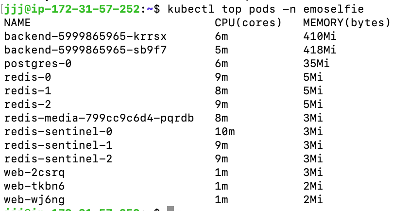

| Pod | CPU | Memory |
|---|---:|---:|
| `backend-5999865965-krrsx` | 6m | 410Mi |
| `backend-5999865965-sb9f7` | 5m | 418Mi |
| `postgres-0` | 6m | 35Mi |
| `redis-0` | 9m | 5Mi |
| `redis-1` | 8m | 5Mi |
| `redis-2` | 9m | 5Mi |
| `redis-media-799cc9c6d4-pqrdb` | 8m | 3Mi |
| `redis-sentinel-0` | 10m | 3Mi |
| `redis-sentinel-1` | 9m | 3Mi |
| `redis-sentinel-2` | 9m | 3Mi |
| `web-2csrq` | 1m | 3Mi |
| `web-tkbn6` | 1m | 2Mi |
| `web-wj6ng` | 1m | 2Mi |

CPU 헤더는 `CPU(cores)`이며 `m`은 millicore다. `1000m = 1 CPU`이므로 `6m = 0.006 CPU`다. 메모리 헤더는 `MEMORY(bytes)`이며 `Mi`는 mebibyte(`1Mi = 1,048,576 bytes`)다.

### 주기적 관측 — 첨부 4

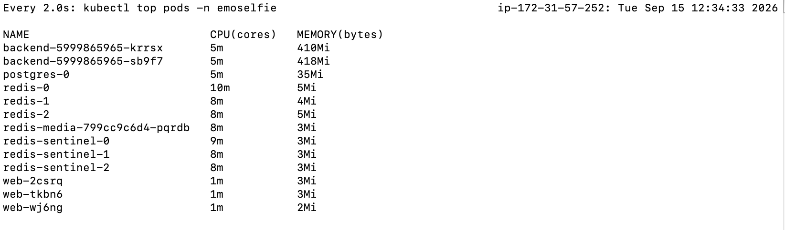

상단에 `Every 2.0s: kubectl top pods -n emoselfie`와 `Tue Sep 15 12:34:33 2026`이 표시된다. backend CPU는 각각 `5m`, 메모리는 `410Mi`·`418Mi`다. 첨부 3과 다른 순간의 값이므로 표에는 첨부 3의 값을 유지했다.

**판정:** Pod별 사용량과 단위를 확인할 수 있다. 해당 화면의 요청 부하 조건과 시간대는 제공되지 않아 이를 무부하 기준선 또는 성능 한계로 단정하지 않는다.

## 3. Service·Ingress 구성 및 외부 요청 응답

### Service·Ingress 조회 — 첨부 5

```bash
kubectl get service,ingress
```

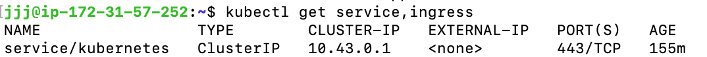

표시된 결과는 `service/kubernetes`, `ClusterIP`, `10.43.0.1`, `443/TCP`뿐이다. 명령에 `-n emoselfie`가 없고 현재 context의 namespace도 표시되지 않으므로, 이 화면으로 애플리케이션 Service·Ingress 구성을 확인할 수 없다. Ingress가 없다는 결론도 내리지 않는다.

### main의 Service·Ingress 구성

[Ingress 소스](https://github.com/k8s11r/emoselfie-INFRA/blob/acc7eba1cce5f32847d7e24d4595e5ea19478490/k8s/base/ingress.yaml)에서 `ingressClassName: traefik`, 이름 `emoselfie`를 확인했다. `/api`, `/media`, `/socket.io`, `/health`는 `backend:8000`, `/`는 `web:80`으로 라우팅한다. backend와 [web Service](https://github.com/k8s11r/emoselfie-INFRA/blob/acc7eba1cce5f32847d7e24d4595e5ea19478490/k8s/base/web.yaml)는 각각 같은 번호의 targetPort를 사용한다. backend Service에는 Traefik sticky cookie 설정이 있다. 이 내용은 현재 코드의 구성 증빙이며, 첨부 5가 보여 주지 못한 운영 조회 결과를 대신하지 않는다.

### 외부 요청 응답 증빙

아래 4절의 Safari 화면에는 운영 HTTPS 주소와 live/ready JSON 응답이 함께 보인다. 이는 브라우저에서 외부 상태 확인 경로의 응답 본문을 받은 증빙이다. HTTP 상태 코드·응답 헤더와 `/`의 웹 화면은 첨부되지 않았다.

**판정:** 외부 상태 확인 응답 본문은 확인되며, 운영 Service·Ingress 구성과 HTTP 200의 직접 증빙은 보완이 필요하다.

## 4. 상태 확인 엔드포인트 응답

### Liveness — 첨부 6

대상: [https://emoselfie.click/health/live](https://emoselfie.click/health/live)

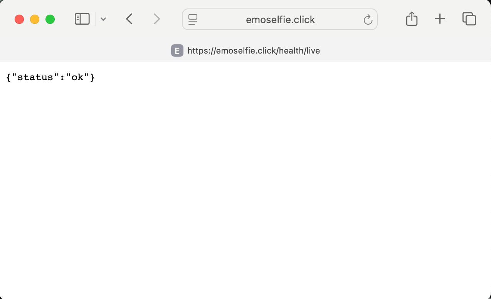

```json
{"status":"ok"}
```

### Readiness — 첨부 7

대상: [https://emoselfie.click/health/ready](https://emoselfie.click/health/ready)

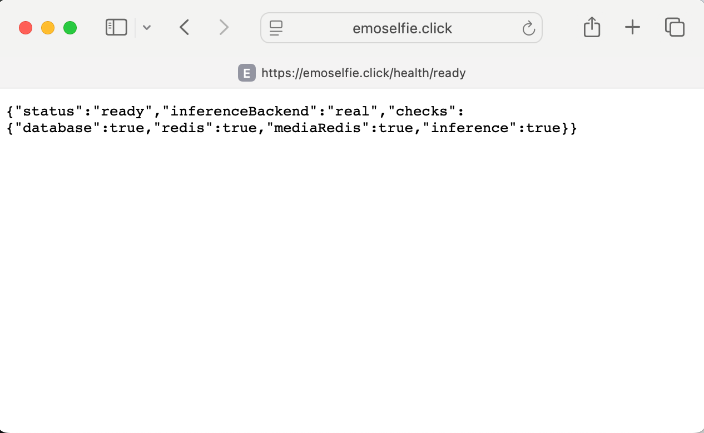

```json
{
  "status": "ready",
  "inferenceBackend": "real",
  "checks": {
    "database": true,
    "redis": true,
    "mediaRedis": true,
    "inference": true
  }
}
```

**판정:** 캡처 본문 기준 live는 `ok`, ready는 `ready`이며 네 개 checks가 모두 `true`다. 추론 backend는 `real`로 표시된다. 실제 사진 제출·채점 완료 여부는 이 응답만으로 판단하지 않는다. 두 화면 모두 정확한 캡처 시각과 HTTP 상태 코드는 미표시다.

## 5. HPA 부하 전후 확장 화면

현재 main에서 backend HPA `minReplicas: 1`, `maxReplicas: 3`, CPU 목표 `70%`를 확인했다. 사용자 보고에 따르면 이 설정은 PR #38을 통해 운영에 적용되었다. 아래 화면에서 직접 확인되는 것은 backend Pod 수의 1→3 변화와 자원 사용 상태다. HPA 객체·이벤트 화면은 첨부되지 않아 자동 확장의 제어 원인과 정확한 발생 시각은 사용자 보고에 의존한다.

### 확장 전: backend 1개 — 첨부 8

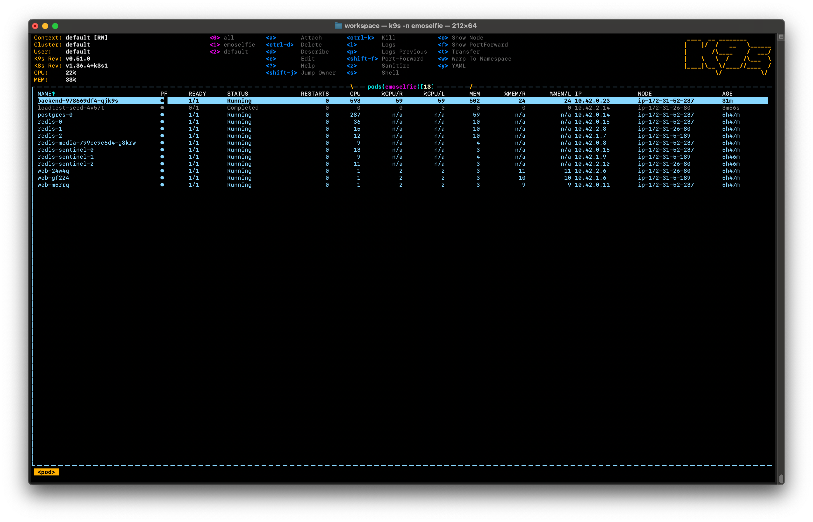

`backend-978669df4-qjk9s` 한 개가 `1/1 Running`, 재시작 0회, AGE `31m`으로 보인다. CPU 표시값은 `593`, `%CPU/R`·`%CPU/L`은 각각 `59`다. 확장 전 화면이지만 테스트 시작 전 또는 무부하 순간인지는 확인되지 않는다.

### 확장 후 첫 화면: backend 3개 — 첨부 10

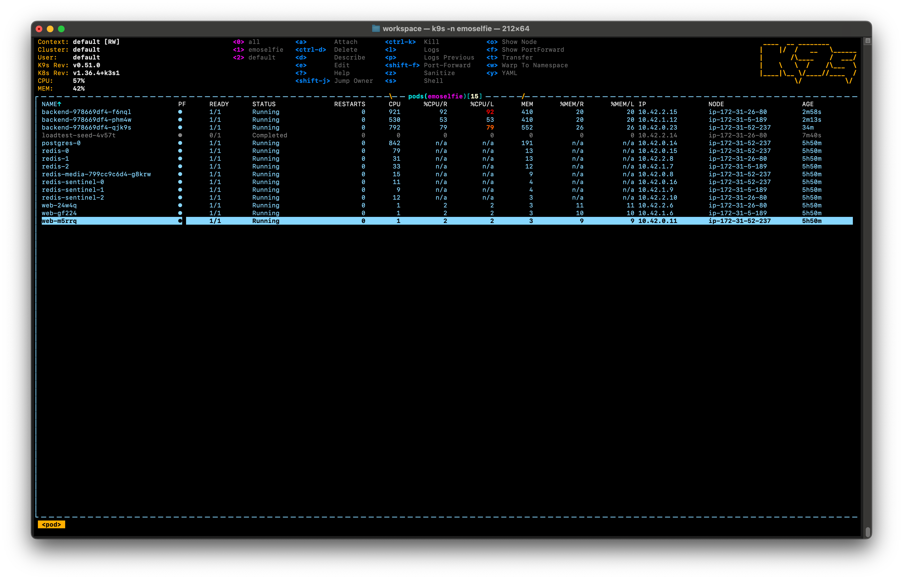

| backend Pod 접미사 | READY / STATUS | CPU 표시값 | %CPU/R · %CPU/L | MEM 표시값 | AGE |
|---|---|---:|---|---:|---|
| `f6nql` | 1/1 Running | 921 | 92 · 92 | 410 | 2m58s |
| `phm4w` | 1/1 Running | 530 | 53 · 53 | 410 | 2m13s |
| `qjk9s` | 1/1 Running | 792 | 79 · 79 | 552 | 34m |

### 확장 후 후속 화면 — 첨부 9

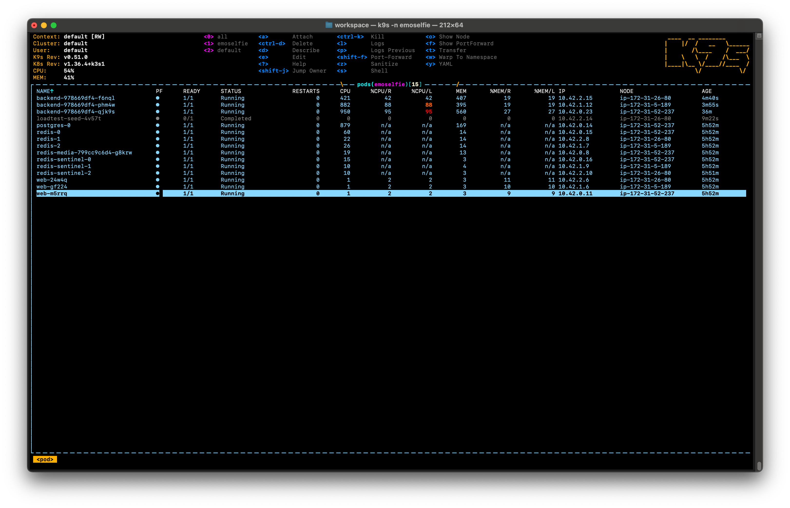

| backend Pod 접미사 | READY / STATUS | CPU 표시값 | %CPU/R · %CPU/L | MEM 표시값 | AGE |
|---|---|---:|---|---:|---|
| `f6nql` | 1/1 Running | 421 | 42 · 42 | 407 | 4m40s |
| `phm4w` | 1/1 Running | 882 | 88 · 88 | 395 | 3m55s |
| `qjk9s` | 1/1 Running | 950 | 95 · 95 | 560 | 36m |

세 Pod는 서로 다른 노드에 배치되고 재시작은 모두 0회다. 첨부 10→9에서 새 Pod 두 개의 AGE가 각각 1분 42초 증가하므로 이 순서로 배치했다. k9s 표에는 CPU·MEM 단위가 직접 표시되지 않아 원시 표시값으로 옮겼으며, 단위가 명시된 증빙은 2절을 사용한다. `%CPU/R`은 request 대비, `%CPU/L`은 limit 대비 비율이다.

**판정:** backend Pod 수의 1→3 증가와 세 Pod의 Running 상태를 확인했다. 전체 backend CPU 비율은 두 확장 후 화면에서 42~95%로 나타나므로, 모든 Pod가 79~95%였다고 일반화하지 않는다. 부하 종료 후 scale-down 화면은 제공되지 않았다.

### 부하 테스트 조건 — 사용자 제공 보고서

| 항목 | 값 |
|---|---|
| 대상 | 운영 EC2, `https://emoselfie.click/`, namespace `emoselfie` |
| 엔드포인트 | `POST /api/rooms/{slug}/rounds/{id}/submissions` |
| 실행 커맨드 | `loadtest/run.sh 100 300 prod` |
| 동시 사용자 | 100명 |
| 지속 시간 | 300초 지정, 실측 299초 |
| 테스트 구간 | 2026-09-16 08:23:55~08:28:54 UTC / 17:23:55~17:28:54 KST |
| 사전 설정 | `PARTICIPANT_GRACE_SEC=86400`(PR #36), backend HPA 1~3개·CPU 목표 70%(PR #38) |
| 설정 적용 근거 | 사용자 보고상 Ansible로 운영 적용 확인. 배포 로그·당시 설정 출력은 미첨부 |
| 원본 데이터 | `20260916-172354_stats.csv`, `20260916-172354_failures.csv`, `20260916-172354_stats_history.csv` |

CSV는 이번 첨부와 현재 작업 공간 검색에서 확보되지 않았다. 아래 수치는 사용자 보고서를 옮긴 것으로 원본 CSV 재계산 결과가 아니다. 원 보고서의 “같은 디렉터리” 표현은 이 문서 디렉터리에 CSV가 있다는 뜻으로 사용하지 않는다.

### 핵심 결과

| 지표 | 값 | 의미 |
|---|---:|---|
| Request Count | 5,667 | 전체 요청 수 |
| Failure Count | 2 | 실패로 집계된 요청 수 |
| 실패율 | 약 0.0353% | 2 / 5,667 × 100 |
| 성공률 | 약 99.9647% | 실패 집계에 포함되지 않은 요청의 비율 |
| Median Response Time | 1,700ms | 중앙값 |
| Average Response Time | 2,221ms | 평균 |
| Min Response Time | 33.9ms | 최소 |
| Max Response Time | 20,327.6ms | 최대, 약 20.3초 |
| Requests/s | 18.94 | 평균 초당 요청 수 |
| Failures/s | 0.0067 | 평균 초당 실패 수 |

이 성공률은 부하 도구의 요청 실패 집계 기준이며, 비동기 추론·채점 완료 성공률과 동일한 지표로 해석하지 않는다.

### 응답 시간 분포

| 퍼센타일 | 응답 시간 |
|---|---:|
| 50% | 1,700ms |
| 66% | 2,300ms |
| 75% | 2,900ms |
| 80% | 3,200ms |
| 90% | 4,300ms |
| 95% | 6,000ms |
| 98% | 9,000ms |
| 99% | 11,000ms |
| 99.9% | 18,000ms |
| 99.99% | 20,000ms |
| 100% | 20,000ms |

p90은 요청의 90%가 약 4.3초 이내에 응답했다는 의미다. 중앙값 1.7초에 비해 p99는 11초로 긴 꼬리가 관찰된다. 퍼센타일 표의 최댓값 20,000ms와 원시 최대 20,327.6ms는 제공값 그대로 보존했으며, 집계·반올림 방식은 CSV 확보 후 확인한다. 이 분포만으로 큐 적체를 확정할 수는 없다.

### 실패 상세

| Method | 경로 | 오류 | 횟수 | 최초 발생 UTC | 최종 발생 UTC |
|---|---|---|---:|---|---|
| POST | `/api/rooms/[slug]/rounds/[id]/submissions` | `502 Server Error: Bad Gateway` | 2 | 2026-09-16 08:26:41 | 2026-09-16 08:27:14 |

사용자 보고상 `403 NOT_A_PARTICIPANT`는 0건이고 402/403 계열 오류도 0건이다. grace 설정 의도에 부합하는 결과지만, 이 테스트에서 관측되지 않았다는 범위로 해석한다.

### EC2 CPU 크레딧 관측 — 첨부 11~13

세 그래프 모두 CPU 크레딧 밸런스가 0에 도달하지 않는다. 아래 값은 그래프의 대략적인 판독값이며 원본 CloudWatch 시계열을 내려받아 재계산한 값은 아니다. 서버 A/B/C는 첨부 순서 기준으로, k9s 노드와의 대응은 확인되지 않았다.

| 구분 | CPU 크레딧 밸런스 추이 | 관측 |
|---|---|---|
| 서버 A / 첨부 11 | 약 43 → 30대 | 크레딧 사용량이 약 6.4까지 상승 |
| 서버 B / 첨부 12 | 약 70 → 77 | 08:20~08:30 부근 사용량 상승 |
| 서버 C / 첨부 13 | 약 65 → 82 | 08:20~08:30 부근 사용량 상승 |

원 보고서의 서버 2·3 번호 대신 첨부 순서와 그래프 값을 기준으로 다시 구분했다. 화면의 CPU 사용률 상승과 테스트 구간은 시간상 겹치지만, 절대 시각이 없는 k9s 화면과 정확한 스케일업 순간까지 일치한다고 확정하지 않는다.

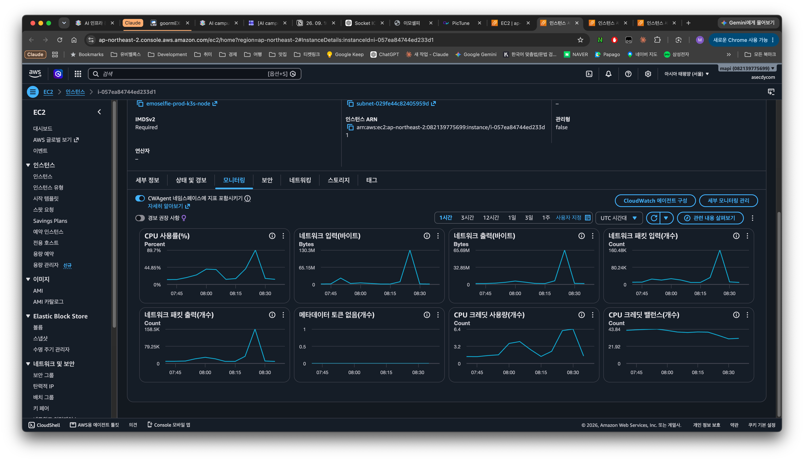

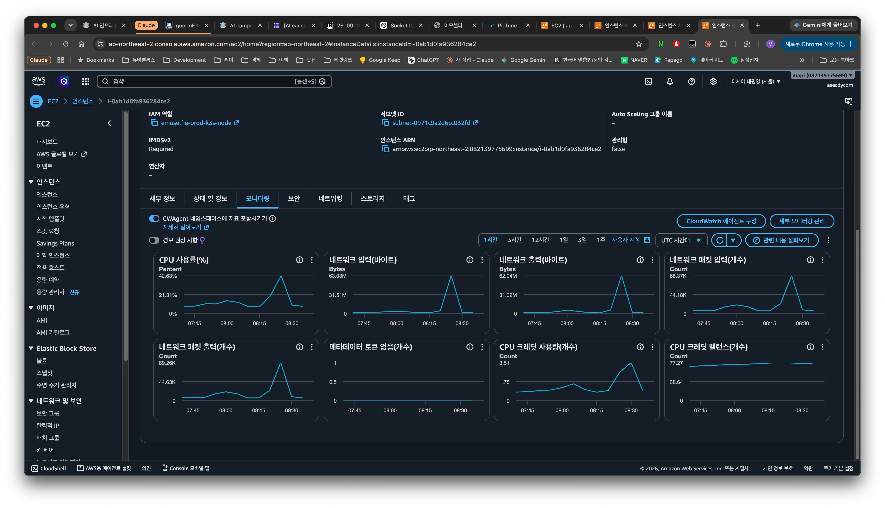

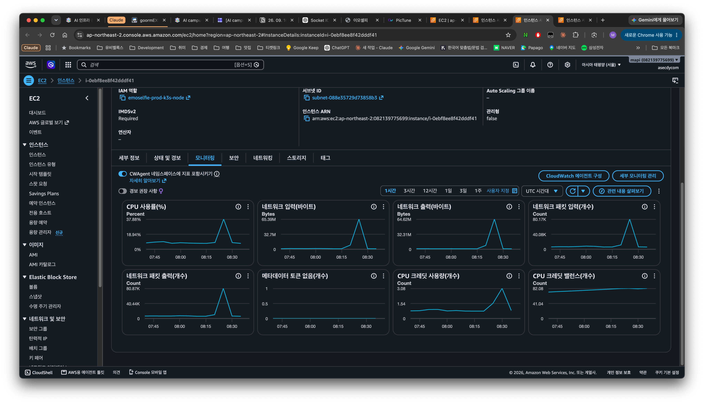

**해석:** 제공된 그래프는 CPU 크레딧 고갈 가설을 지지하지 않는다. 다만 이 자료만으로 모든 종류의 CPU 병목·컨테이너 CPU 제한을 배제할 수는 없다.

### 분석과 미확정 가설

1. 사용자 보고 기준 요청 성공률은 약 99.96%이고, 캡처에는 backend 1→3개 확장이 관찰된다.
2. 운영 중앙값은 1.7초, p99는 11초, 최대는 약 20.3초다. 원 보고서는 로컬 중앙값을 수십~수백 ms대로 기술했으나 로컬 원본과 동일 조건 여부가 없어 정량 비교는 유보한다.
3. 추론 큐 적체는 조사할 가설이다. 사용자 보고의 `INFERENCE_QUEUE_CAPACITY=24`, Pod당 `INFERENCE_CONCURRENCY=2`라면 3개 Pod의 설정상 동시 추론 슬롯은 합계 6개다. 실제 처리량은 추론 시간과 병목에 따라 달라지므로 18.94 req/s만으로 처리 용량 초과를 증명할 수 없다.
4. 현재 main의 [업로드 API](https://github.com/k8s11r/emoselfie-BE/blob/b2aefd4899f38b1a7cd104af602523de5fb6467e/app/api/submissions.py)는 본문 읽기·이미지 검사·DB/Redis 처리와 `dispatch()`를 거쳐 202를 반환한다. [dispatch 구현](https://github.com/k8s11r/emoselfie-BE/blob/b2aefd4899f38b1a7cd104af602523de5fb6467e/app/domain/round/runner.py)은 상태 전송 등의 작업 후 `asyncio.create_task()`로 채점을 시작한다. [추론 runner](https://github.com/k8s11r/emoselfie-BE/blob/b2aefd4899f38b1a7cd104af602523de5fb6467e/app/inference/runner.py)는 `put_nowait()`로 큐에 넣고, 가득 차면 `InferenceOverloaded`를 발생시킨다. 따라서 “큐에 빈자리가 생길 때까지 업로드 요청이 기다려 20초가 걸렸다”는 직접적인 설명은 이 코드로 뒷받침되지 않는다. 공유 자원 경쟁에 따른 간접 지연 가능성과 업로드·DB·Redis·이벤트 전송 구간을 별도로 조사해야 한다. 당시 운영 이미지가 이 BE 커밋인지도 추가 확인 대상이다.
5. 502 두 건과 확장 간 인과관계는 미확정이다. 같은 부하 구간이라는 사실만으로 신규 Pod 라우팅 문제라고 결론 내리지 않는다.

## 보완할 증빙

- [ ] `emoselfie` namespace의 Service·Ingress 조회와 backend EndpointSlice 화면.
- [ ] live/ready의 HTTP 상태 코드·헤더, 조회 직전 UTC/KST 시각과 context가 함께 보이는 캡처.
- [ ] 기존 캡처의 정확한 촬영 시각·시간대. 확인 불가한 경우 미상 표시 유지.
- [ ] HPA 설정·현재/목표 replica·이벤트와 시각, 필요 시 부하 종료 후 scale-down 화면.
- [ ] 원본 CSV 3개 첨부 및 집계값 대조.
- [ ] 2026-09-16 08:23~08:29 UTC backend 에러·경고·큐 로그 확인.
- [ ] 같은 구간의 Traefik 및 사용 중인 외부 로드밸런서 로그로 502 원인 확인.
- [ ] 로그 근거를 확보한 뒤 `INFERENCE_QUEUE_CAPACITY`·`INFERENCE_CONCURRENCY` 튜닝 검토.

추가 수집 시 사용할 **조회 명령 예시**다. 이번 문서 작업에서 실행한 명령이 아니며, 운영 context 선택 여부를 확인한 뒤 사용한다.

```bash
date -u '+%Y-%m-%d %H:%M:%S UTC'
TZ=Asia/Seoul date '+%Y-%m-%d %H:%M:%S KST'
kubectl config current-context
kubectl get service,ingress -n emoselfie -o wide
kubectl get endpointslices -n emoselfie -l kubernetes.io/service-name=backend -o wide
kubectl get hpa -n emoselfie
kubectl describe hpa -n emoselfie
kubectl get pods -n emoselfie -o wide
curl -i --max-time 10 https://emoselfie.click/health/live
curl -i --max-time 10 https://emoselfie.click/health/ready
```

## 첨부 관리

이미지는 `assets/monitoring-2026-09-16/`에 제공 원본 그대로 보관하고 상대 경로로 연결했다. 파일명의 번호는 원래 첨부 순서를 유지한다. 본문에서는 HPA의 상대 시간 순서에 맞춰 8→10→9번으로 제시한다. 이 문서와 이미지 13개가 한 묶음이며, 기존 문서·운영 설정은 변경하지 않았다.
